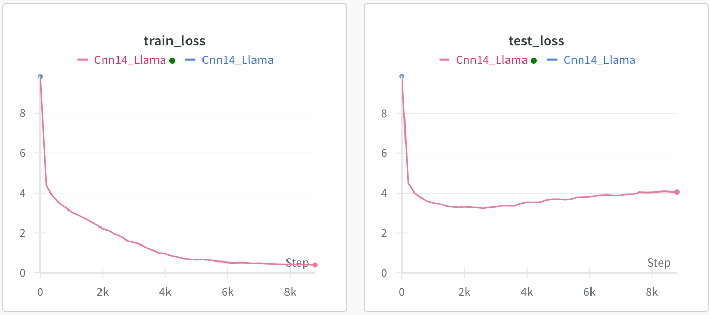

#Highlight of this Project 
Automated audio captioning (AAC) generates natural language descriptions of general audio content, enabling applications like media annotation and assistive technologies. This study implements an AAC system using CNN14 as an encoder and Llama as a decoder, trained on the Clotho dataset. We evaluate performance using metrics including METEOR, CIDEr, and SPIDEr-FL. Additionally, we explore enhancements via HTS and CLAP architectures. My model achieves robust results after 20,000 training steps on an RTX4090 GPU, with a user-friendly PyQt6 interface for real-time audio analysis.

# Audio Caption with PyTorch

This procedure provides a minimal implementation of audio caption system with PyTorch. The system is trained on the [Clotho](https://zenodo.org/records/3490684) dataset. The audio caption system consists of a pretrained audio encoder and an LLM-based caption decoder.

## 0. Install dependencies

```bash
# Clone the repo
git clone https://github.com/qiuqiangkong/mini_audio_caption
cd audio_caption

# Install Python environment
conda create --name audio_caption python=3.10

# Activate environment
conda activate audio_caption

# Install Python packages dependencies
bash env.sh
```

# Download datasets

Download the [Clotho](https://zenodo.org/records/3490684) dataset. The downloaded datasets look like:

<pre>
dataset_root (7.3 GB)
├── clotho_audio_development (2894 wavs)
├── clotho_audio_evaluation (1046 wavs)
├── clotho_captions_development.csv
├── clotho_captions_evaluation.csv
├── clotho_metadata_development.csv
├── clotho_metadata_evaluation.csv
└── LICENSE
</pre>

## 1. Train

```python
CUDA_VISIBLE_DEVICES=0 python train.py
```

We train the audio caption on the Clotho dataset. The training takes around 20 min to train on a single RTX4090. 



## 2. Inference

```python
CUDA_VISIBLE_DEVICES=0 python inference.py --ckpt_path="./checkpoints/train/Cnn14_Llama/step=10000.pth"
```

The predicted caption of [young artist.wav](assets/young_artists.wav) looks like:

<pre>

</pre>
## 3 UI Display instruction
After running the code of UI_Code,py, you will receive a colorful interface including blocks of audio path, symbol image, play audio or run inferences buttons, record function button and audio waves exhibition. 
If you upload a file from your local, you can see the audio path on the left of the interface, then you can play the audio by clicking the play audio button. Aftering running the inference by clicking run model prediction button, the prediction will be shown in the model prediction block.
In another case, if you have already recorded an audio, then click run live prediction and you will see the prediction shown in the live environment sound caption block. 
The audio wave will be dynamic according to the different recorded audio files. 
The final output of the interface will be similar to UI04(2).png. 

## External links

The LLM decoder is based on mini_llm: https://github.com/qiuqiangkong/mini_llm

## License

MIT
